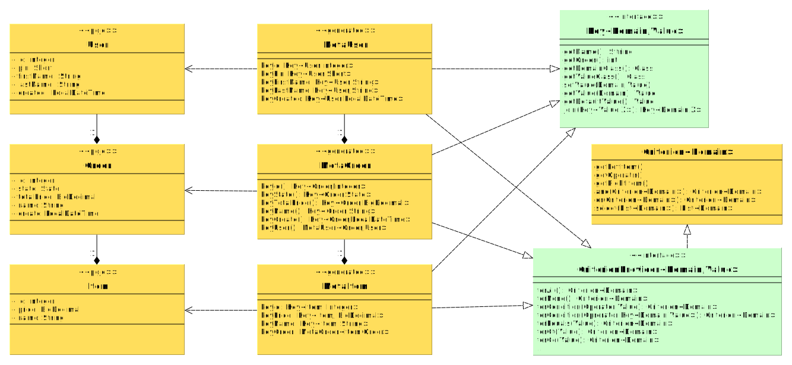

# Popis architektury key-value s podporou POJO inspirovaný frameworkem Ujorm

## Úvod

Tento dokument popisuje návrh API architektury  typu `key-value`, které bude fungovat s běžnými objekty typu POJO.
Řešení předpokládá v projektu existenci generových tříd meta-modelu generovavných podle podle předlohy POJO.- například pluginem Mavenu.
V návrhu je interface [Ujo](http://ujorm.org/javadoc/org/ujorm/Ujo.html) nadbytečný a proto API nemůže být
zpětně kompatibilní se současným frameworkem [Ujorm](https://ujorm.org/). 
Odstraněním interface `Ujo` se však zkomplikuje implementace 
některých služeb, jako je třeba správa parametrů v projektu 
[DemoHotels](https://hotels.ujorm.org/source?src=org.ujorm.hotels.gui.hotel.HotelTable).


## Nové vlastnosti

* Instance [klíče](http://ujorm.org/javadoc/org/ujorm/Key.html) budou podporovat přímou JavaSerializaci 
 (původní implementaci vyžadovala obalení klíčů před serializací do objektu KeyRing). V důsledku této vlastnosti 
  však už nelze garantovat unikátní instanci dvou stejných přímých klíčů..
* Vznikne nový kontext meta-modelu `UjoContext` pro poskytování instancí meta-objektů s cílem zajisit (pokud možno) unikátní instance meta-modelu.
  Vývojář může poskytnout explicitně jiný kontext a tak jejich počet může být násobný.
* Každý meta-model bude obsahovat referenci na třídu POJO a opačně.
* Po získání meta-modelu se tvorba složených klíčů výrzně zjednoduší, protože se použijí pouze metody bez statických konstant.
* POJO objekty v ORM mohou používat standardní JPA anotace (zřejmě v omezené míře).

## Class model

Zjednodušené schema:




## Ukázky použití

```java
    /** Reading from / writing to an Order */
    public void doOrderAccess() {
        MetaOrder<Order> metaOrder = MetaOrder.of();

        Key<Order, Integer> keyOrderId = metaOrder.keyId();
        Key<Order, String> keyUserName = metaOrder.keyUser().keyFirstName();

        Order order = metaOrder.newDomain();
        keyOrderId.set(order, 1);
        keyUserName.set(order, "Pavel");
        Integer id = keyOrderId.get(order);
        String name = keyUserName.get(order);
    }
```

```java
    /** Reading from / writing to an Item */
    public void doItemAccess() {
        MetaItem<Item> metaItem = MetaItem.of();

        Key<Item, Integer> keyItemId = metaItem.keyId();
        Key<Item, User> keyUser = metaItem.keyOrder().keyUser();
        Key<Item, Short> keyPin = metaItem.keyOrder().keyUser().keyPin();

        Item item = metaItem.newDomain();
        keyItemId.set(item, 1);
        Integer orderId1 = keyItemId.get(item);
        keyUser.set(item, new User());
        User user = keyUser.get(item);
        keyPin.set(item, (short) 125);
        Short userPin = keyPin.get(item);
    }
```

```java
    /** Criterions */
    public void doItemCondition() {
        MetaItem<Item> mItem = MetaItem.of();

        Criterion<Item> itemCrn1 = mItem.forAll();
        List<Item> items = itemCrn1.select(findItemsService());

        Criterion<Item> criton1 = mItem.keyOrder().keyId().forEq(10);
        Criterion<Item> criton2 = mItem.keyOrder().keyCreated().forLe(LocalDateTime.now());
        Criterion<Item> criton3 = criton1.and(criton2);
        List<Item> result = criton3.select(findItemsService());
    }
```

Návrh API (compile-ready draft) je uložen ve větvi 
[Ujo2](https://github.com/pponec/ujorm/blob/Ujorm2/project-m2/ujo2-core/src/test/java/org/ujorm/service/MySampleService.java). 


## Implementace návrhu

Přesto, že tento návrh může vypadat zajímavé, v jeho implementaci současné době neplánuji.
.

--

Zpracoval Pavel Ponec, 

autor frameworku Ujorm,

dne: 22.3.2019