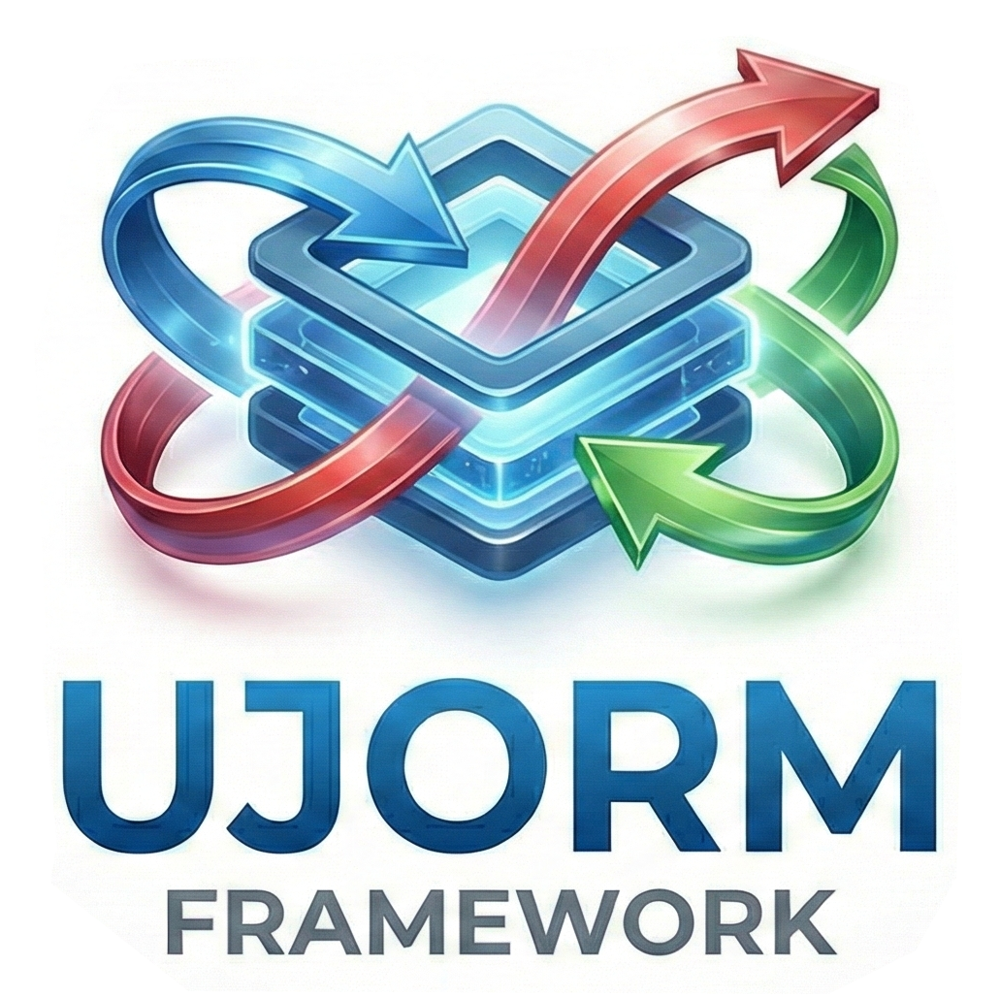

#  Ujorm3 Framework

*<span style="color: grey;">The original Ujorm v2 homepage has moved [here](docs/ujorm2).</span>*

> *"Do the simplest thing that could possibly work."*  
> — Kent Beck, creator of Extreme Programming and pioneer of Test-Driven Development.

Ujorm3 is a lightweight Object-Relational Mapping (ORM) library designed for efficient relational database development with minimalist code and a straightforward API.
The library maps database rows to standard Java objects using clean SQL without unnecessary abstraction.
It supports mapping to both mutable JavaBeans and immutable Records, including M:1 relations.

To achieve data manipulation speeds comparable to hand-written JDBC code, Ujorm3 compiles its own bytecode at runtime.
At its core, the library is built around the **Typed Key Pattern** to handle domain objects efficiently.
These keys act as typed descriptors, providing compile-time safety without casting and enabling fast bulk operations.
Consequently, the overhead of Java reflection is strictly limited to the initial loading of object metadata.

### Design Philosophy & Constraints

To maintain a high utility-to-code ratio and minimize bugs, Ujorm3 intentionally limits its scope:
*   **No Lazy-Loading:** To prevent hidden performance costs and the N+1 query problem, relationships are not lazily fetched.
*   **M:1 Relations Only:** Collection attributes (1:M) are not supported. The recommended approach is to query from the "many" side or use a secondary SQL query.
*   **No Magic / No Stateful Lifecycle:** The library does not manage object lifecycles, database transactions, or entity data caching. Entities are treated as stateless data carriers.
*   **No SQL Dialects:** Advanced queries are written in native SQL. While this ties you to a specific database syntax, it unlocks the full performance and feature set of your underlying database engine.

---

## Menu
* [Basic CRUD Operations](#basic-crud-operations)
    * [SELECT](#select)
    * [INSERT](#insert)
    * [UPDATE](#update)
    * [DELETE](#delete)
    * [All Examples](#all-examples)
* [Class Diagram](#class-diagram)
* [Generated Meta Models](#generated-meta-models)
* [Maven Dependencies & Setup](#maven-dependencies--setup)
* [Benchmarks](#benchmarks)
* [FAQ](#faq)
* [Feedback & Contributions](#feedback--contributions)

---

## Basic CRUD Operations

Basic mapping utilizes standard Jakarta annotations (`@Table`, `@Column`).
Advanced SELECT queries with JOINs use a dot-notation alias format (e.g., `city.name`) directly in the native SQL.
Entities do not need to be registered beforehand, and multiple classes can map to the same database table.

### SELECT

The library allows you to write native SQL queries while maintaining type safety.
By using the generated `Meta` classes for aliases (`${...}`), you prevent SQL typos and ensure safe mapping.
The conversion from the `ResultSet` to the domain object is entirely explicit, effectively eliminating the dreaded N+1 query problem.

```java
private static final EntityManager<City, Long> CITY_EM = EntityManager.of(City.class);
private static final EntityManager<Employee, Long> EMPLOYEE_EM = EntityManager.of(Employee.class);

void select() {
    var sql = """
            SELECT e.id      AS ${e.id}
            , e.name         AS ${e.name}
            , c.name         AS ${c.name}
            , c.country_code AS ${c.country_code}
            , b.name         AS ${b.name}
            FROM employee e
            JOIN city c ON c.id = e.city_id
            LEFT JOIN employee b ON b.id = e.boss_id
            WHERE e.id > :employeeId
            """;

    List<Employee> employees = SqlParamBuilder.run(connection(), builder -> builder
            .sql(sql)
            .label("e.id", MetaEmployee.id)
            .label("e.name", MetaEmployee.name)
            .label("c.name", MetaEmployee.city, MetaCity.name)
            .label("c.country_code", MetaEmployee.city, MetaCity.countryCode)
            .label("b.name", MetaEmployee.boss, MetaEmployee.name)
            .bind("employeeId", 0L)
            .streamMap(EMPLOYEE_EM::map)
            .toList());
}
```

Database columns can also be mapped without using metamodel keys.
In this case, simply use dot-notation for property names within the SQL command (e.g., `"city.name"`).
Note that these expressions must be enclosed in quotes, using the specific character required by your database vendor.

### INSERT

Ujorm3 seamlessly handles auto-assigned primary keys.
When inserting an immutable Java Record (like `City`), the library creates and returns a new instance with the generated ID.
For mutable JavaBeans (like `Employee`), the ID is simply injected into the existing object.
For high-performance scenarios, batch operations are explicitly supported.

```java
void insert() {
    var employeeCrud = EMPLOYEE_EM.crud(connection());
    var cityCrud = CITY_EM.crud(connection());

    var cityOttawa = cityCrud.insert(new City(null, "Ottawa", "CA"));

    var emplIngird = Employee.of("Ingrid", cityOttawa, null);
    var emplDave = Employee.of("Dave", cityOttawa, emplIngird);
    var emplCarol = Employee.of("Carol", cityOttawa, emplIngird);

    employeeCrud.insert(emplIngird);
    employeeCrud.insertBatch(emplDave, emplCarol);
}
```

### UPDATE

In the UPDATE example, notice the subtle argument at the very end of the `update` method call.
This vararg parameter empowers developers to explicitly define which entity attributes should be used to update the database table.
The example demonstrates passing a type-safe key from the auto-generated metamodel.
However, if necessary, you can also provide an array of Strings instead.

```java
void update() {
    var employeeCrud = EMPLOYEE_EM.crud(connection());

    var emplIngird = employeeCrud.findById(1L).orElseThrow();
    var emplDave = employeeCrud.findById(2L).orElseThrow();
    var emplCarol = employeeCrud.findById(3L).orElseThrow();

    emplIngird.setBoss(emplDave);
    emplDave.setBoss(null);
    emplCarol.setBoss(emplDave);

    employeeCrud.update(Stream.of(emplIngird, emplDave, emplCarol), 
                        MetaEmployee.boss);
}
```

Furthermore, if a developer provides the original version of the domain object during an update operation, the library automatically detects the changes.
It creates a set of keys representing the modified attributes and subsequently calls the update method shown above.

### DELETE

The deletion method itself probably won't surprise you.
What is more interesting is the process of retrieving a collection of entities without explicitly listing individual columns in the SELECT statement.
This is achieved by calling the `selectWhere` method, which utilizes an inner class or lambda expression to configure the query.
Within this block, the library provides an `SqlParamBuilder` instance, allowing you to seamlessly map the result set using the `streamMap` method.

```java
void delete() {
    var employeeCrud = EMPLOYEE_EM.crud(connection());

    var allEmployees = employeeCrud
            .selectWhere("id > :id", builder -> builder
                    .bind("id", 0L)
                    .streamMap(EMPLOYEE_EM::map)
                    .sorted(Comparator.comparing(e -> e.getBoss() == null))
                    .toList());

    employeeCrud.delete(allEmployees.stream());
}
```

### All Examples

To see the complete picture, all the code snippets shown above are extracted from a single, sequential JUnit test suite.
This test class demonstrates the full lifecycle of entities within the library, from database initialization to final cleanup.
Please note that a database commit is performed automatically by the parent class after each test method finishes.
Feel free to run and modify this test locally to get a hands-on feel for the API.

Explore the full source code here: [BasicDemoTest.java in the Ujorm3 project](project-m2/ujo-orm/src/test/java/org/ujorm/orm/tutorial/TutorialTest.java).

## Class Diagram

<p align="center">
  
</p>

The image shows a simplified class diagram describing the API for working with the **Ujorm3** library.
All depicted methods are public.
The `SqlParamBuilder` class is an autonomous class with a database connection and no other dependencies.
It acts as a facade over an internal `PreparedStatement` object.
Calling a `SELECT` statement leads to the creation of a `Stream<ResultSet>` object, which is efficiently converted to objects by the `ResultSetMapper` class.
This is the second autonomous class that requires no other dependencies.
Both classes cooperate with arbitrary objects of the **JavaBean** or **Record** type.
For database mapping, annotations from JPA/Jakarta are recommended: `@Table`, `@Column`, and `@Id`.
However, if they are missing, Ujorm3 will not fail and will attempt to derive the required properties automatically.
If an attribute is a class with the `@Table` annotation, it is considered an M:1 relationship.
Other types of relationships are not directly supported and must be resolved by proper SQL query modeling.
The third important component is the `EntityManager` class, which works directly with entities.
Entities are domain objects with a 1:1 relationship to database columns.
The same types of objects and annotations are supported for entities as in the previous cases.
For basic entity manipulation, the `EntityManager` creates a `Crud` object that works with a database connection.
This object provides all standard database operations of the **CRUD** type.

### Caching Strategy

There is **no data caching** for user queries.
However, to maximize speed, Ujorm3 caches metadata:

* **ResultSetMapper:** Caches column mapping structures to avoid repeatedly analyzing dot-notation labels or querying JDBC metadata. If the cache exceeds the limit (default 512 distinct queries), it clears itself to prevent memory leaks.
* **EntityManager:** Retains the database table metamodel for each entity. It is recommended to use the `EntityManagerService` to retrieve shared singleton instances.

### Generated Meta Models

To ensure type safety without relying on string literals, Ujorm3 provides an Annotation Processor that generates `Meta` classes at compile time.

```java
package org.ujorm.orm.tutorial.domains;

import org.ujorm.Key;
import org.ujorm.DomainHandler;
import org.ujorm.core.DomainHandlerProvider;

/** Auto-generated metamodel for Employee */
public class MetaEmployee {
    private static final DomainHandler<Employee> meta = DomainHandlerProvider.getHandler(Employee.class);

    public static final Key<Employee, Long> id = meta.getKey("id");
    public static final Key<Employee, String> name = meta.getKey("name");
    public static final Key<Employee, City> city = meta.getKey("city");
    public static final Key<Employee, Employee> boss = meta.getKey("boss");
}
```

Metamodel keys are a core asset of this library.
The `DomainHandler` object prepares these keys upon the first request and consistently returns the exact same instances thereafter, effectively making them singletons within the entity context.
Consequently, using these objects in a `HashMap` is exceptionally fast, as mismatches are instantly eliminated by the hash and matches are confirmed through simple reference comparison rather than complex content evaluation.
Additionally, the key implementation includes precompiled methods for lightning-fast reading and writing of values directly from the domain object.
The keys also implement the `CharSequence` interface, which significantly expands their versatility across the API.
This means they can be used in many places just like standard text, since the `String` class implements the very same interface.
Furthermore, relying on two generic types allows the keys to be chained in a strictly type-safe manner right at compile time.
This precise capability is leveraged by the `SqlParamBuilder` API to safely map and assign labels within SQL statements.

You can find the source code for the interface [here](project-m2/ujo-tools/src/main/java/org/ujorm/Key.java).

## Maven Dependencies & Setup

Ujorm3 requires **Java 17 or higher**.
To get started, simply add the core Ujorm3 dependencies to your Maven project.
By default, you can write database queries using standard text literals.
However, if you prefer a safer, strongly-typed coding style, you can optionally configure the `maven-compiler-plugin` to include the Ujorm3 Meta Processor.

```xml
<dependencies>
    <!-- 1. Ujorm3 Core Dependencies -->
    <dependency>
        <groupId>org.ujorm</groupId>
        <artifactId>ujorm-core</artifactId>
        <version>3.0.0-BETA</version>
    </dependency>
    <dependency>
        <groupId>org.ujorm</groupId>
        <artifactId>ujorm-orm</artifactId>
        <version>3.0.0-BETA</version>
    </dependency>
</dependencies>

<build>
<plugins>
    <!-- 2. Compiler Plugin Setup -->
    <plugin>
        <groupId>org.apache.maven.plugins</groupId>
        <artifactId>maven-compiler-plugin</artifactId>
        <version>3.14.1</version>
        <configuration>
            <annotationProcessorPaths>
                <!-- Optional: APT configuration for Lombok -->
                <path>
                    <groupId>org.projectlombok</groupId>
                    <artifactId>lombok</artifactId>
                    <version>${lombok.version}</version>
                </path>
                <!-- APT configuration for Ujorm3 -->
                <path>
                    <groupId>org.ujorm</groupId>
                    <artifactId>ujorm-meta-processor</artifactId>
                    <version>3.0.0-BETA</version>
                </path>
            </annotationProcessorPaths>
            <compilerArgs>
                <!-- Optional attributes for APT Ujorm3 -->
                <arg>-Aujorm.prefix=Meta</arg>
                <arg>-Aujorm.suffix=</arg>
            </compilerArgs>
        </configuration>
    </plugin>
</plugins>
</build>
```

---

## Benchmarks

Performance tests comparing Ujorm3 to popular modern ORM frameworks were executed using an in-memory database.
While performance differences may blur on slower production databases, Ujorm's lightweight nature significantly reduces the deployment footprint and maintenance overhead.

**Version tested:** `3.0.0-BETA`  
**Full benchmark source and results:** [GitHub: orm-benchmarks](https://github.com/pponec/orm-bencharks?tab=readme-ov-file#orm-benchmark)

| Framework | Operations / sec | JAR Size Profile |
| :--- | :--- | :--- |
| **Ujorm3** | Highly Competitive | **Ultra-lightweight** (\< 500 KB) |
| Hibernate / JPA | Baseline | Heavy (Megabytes) |
| Spring Data JDBC | Competitive | Medium |
| Exposed (Kotlin) | Competitive | Heavy (with Kotlin core) |

*Note: The final JAR size column reflects the packaged test with all dependencies included.*
*A smaller compiled footprint promises a gentler learning curve and a reduced risk of bugs, beneficial even for embedded devices.*

---

## FAQ

**Will Ujorm v2 still be supported?**<br/>
No, support for Ujorm v2 has ended and no further versions will be released.
The original module remains available in the Git repository.

**Do domain objects need to implement `Serializable`?**<br/>
No.
Ujorm3 works purely with stateless data structures and does not require serialization.

**Is `@JoinColumn` required for relations?**<br/>
No, the use of `@JoinColumn` is optional.
The library automatically recognizes a relationship whenever the attribute's type is a class annotated with `@Table`, seamlessly supporting self-referencing entities as well.

**Does Ujorm3 create temporary files during runtime compilation?**<br/>
No, the bytecode generation happens purely in RAM.
This process requires no temporary disk space, which avoids potential file system permission issues and maximizes performance.

**Are the core components like `EntityManager` thread-safe?**<br/>
Yes, core components such as `EntityManager` and the generated `Meta` classes are strictly stateless and completely thread-safe.
They are designed to be shared across your entire application as singletons.
Conversely, objects that wrap a database connection, like the `Crud` instance or `SqlParamBuilder`, are stateful and must be scoped to a single thread or request.

---

## Feedback & Contributions

We are excited to share Ujorm3 and would love to hear your thoughts!
Whether you want to provide feedback, report a bug, suggest a feature, or just chat about the library's minimalist approach, please join the conversation on our GitHub page:

👉 **[Join the Discussion / Open an Issue on GitHub](https://github.com/pponec/ujorm)**

Your input is crucial in shaping the future of this lightweight ORM.