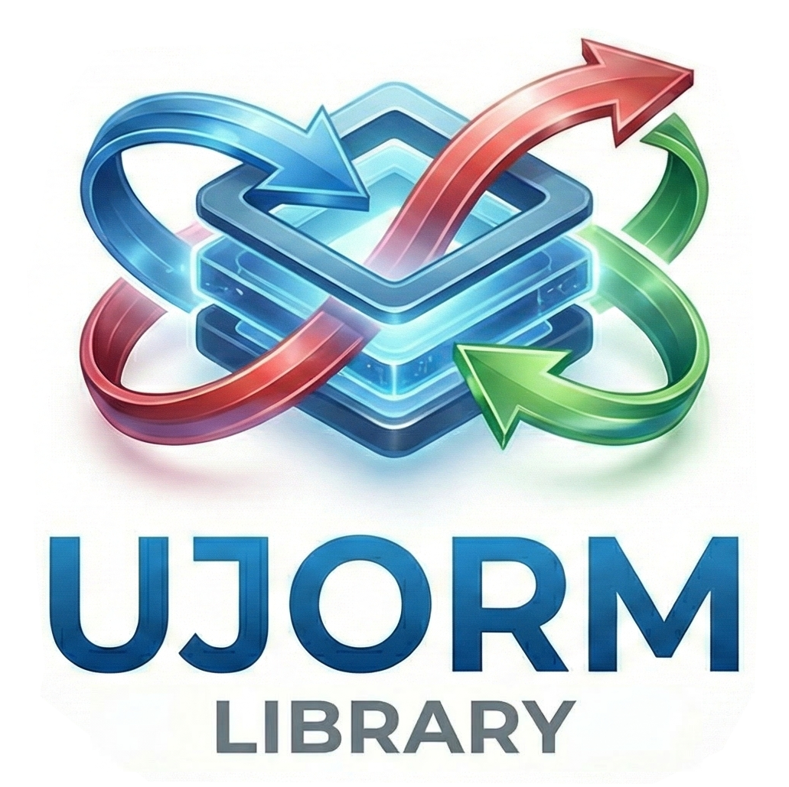
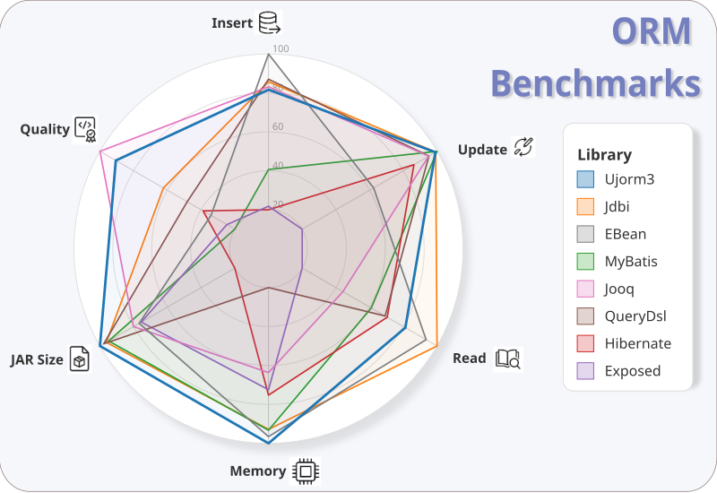
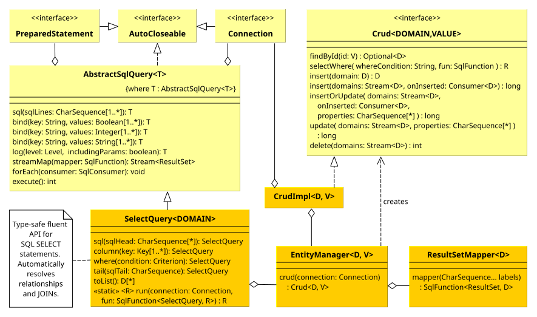

#  Ujorm3 Library

*<span style="color: grey;">The original Ujorm2 homepage has moved [here](https://ujorm.org/www/web/).</span>*

> *"Do the simplest thing that could possibly work."*
— Kent Beck, creator of Extreme Programming and pioneer of Test-Driven Development.

Ujorm3 is a lightweight object-relational mapping (ORM) library designed for efficient relational database development with minimalist code and a straightforward API.
The library maps database rows to standard Java objects using clean SQL without unnecessary abstraction.
It supports mapping to both mutable JavaBeans and immutable Records, including M:1 relations.

To achieve data manipulation speeds comparable to hand-written JDBC code, Ujorm3 compiles its own bytecode at runtime.
At its core, the library is built around the **Typed Key Pattern**.
These keys act as typed descriptors, providing compile-time safety without casting and enabling fast bulk operations.
Consequently, the overhead of Java reflection is strictly limited to the initial loading of object metadata.

### Design Philosophy

To maintain a high utility-to-code ratio and minimize bugs, Ujorm3 intentionally limits its scope:
* **No Lazy Loading:** Relationships are not lazily fetched to avoid hidden database round-trips typical of transparent lazy loading. You still need explicit fetches or batch queries where you would otherwise load related data in a loop (an N+1 pattern).
* **M:1 Relations Only:** Collection attributes (1:M) are not supported.
  Query from the "many" side or use a secondary SQL query instead.
* **No Magic / No Stateful Lifecycle:** The library does not manage database transactions or entity caching.
  Entities are treated as stateless data carriers.
* **No SQL Dialects:** Advanced queries are written in native SQL.
  This unlocks the full performance and feature set of your specific database engine.

<div align="center">

</div>

Ujorm3 delivers highly competitive performance compared to popular ORM frameworks while consistently maintaining a minimal memory footprint.
Detailed results and methodology are available in the [Benchmarks](#benchmarks) section.

---

## Table of Contents
* [Quick Start (TL;DR)](#quick-start-tldr)
* [Detailed Operations & Relations](#detailed-operations--relations)
    * [SELECT](#select-joins-and-advanced-filtering)
    * [INSERT](#insert-generation-and-batching)
    * [UPDATE](#update-partial-changes)
    * [DELETE](#delete-integrity-and-ordering)
    * [All Examples](#all-examples)
* [Class Diagram](#class-diagram)
* [Generated Meta Models](#generated-meta-models)
* [Configuration](#configuration)
* [Maven Dependencies & Setup](#maven-dependencies--setup)
* [Benchmarks](#benchmarks)
* [FAQ](#faq)
* [Feedback & Contributions](#feedback--contributions)
* [Related Links](#related-links)

---

## Quick Start (TL;DR)

Ujorm3 provides a specialized toolset for different levels of complexity. Choose the one that best fits your current task:

### 1. EntityManager (Simple CRUD by ID)
The fastest way to handle single-table operations by primary key. It requires no SQL writing and supports standard Jakarta annotations.

```java
/** Simple CRUD operations for Entities */
void simpleCrud(java.sql.Connection connection) {
    var crud = CITY_EM.crud(connection);
    var saved = crud.insert(new City(null, "Barcelona", "ES"));
    var barcelona = crud.findById(saved.id()).orElseThrow();
}
```

### 2. SelectQuery (Type-Safe Object Querying)
The primary tool for searching and fetching relations. It uses **`Criterion`** objects for type-safe filtering (verifying both structure and parameter types) and handles `JOIN` clauses automatically.

```java
/** Type-safe selection */
List<Employee> findEmployees(Connection connection) {
    return SelectQuery.run(connection, EMPLOYEE_EM, query -> query
            .columns(true)     // Select all domain columns including foreign keys
            .column(MetaEmployee.city, MetaCity.name)
            .where(MetaEmployee.id.whereGe(1L))
            .toList());
}
```

### 3. SqlQuery (Universal Native SQL)
A universal approach for complex requirements. It allows writing raw SQL while maintaining safety via `bind()` and `label()`. Using the **generic mapper**, Ujorm3 can automatically populate even nested relations by matching SQL aliases to Key paths.

```java
/** Universal native SQL with relations */
List<Employee> findEmployees(Connection connection) {
    return SqlQuery.run(connection, query -> query
            .sql("""
                    SELECT e.id  AS ${e.id}
                    , e.name     AS ${e.name}
                    , c.name     AS ${c.name}
                    FROM employee e
                    JOIN city c ON c.id = e.city_id
                    WHERE e.id >= :id
                    """)
            .label("e.id"  , MetaEmployee.id)
            .label("e.name", MetaEmployee.name)
            .label("c.name", MetaEmployee.city, MetaCity.name) // Key Path mapping
            .bind("id", 1L)
            .toStream(EMPLOYEE_MAPPER.mapper()) // Generic mapping including relations
            .toList());
}
```

---

## Detailed Operations & Relations

While the Quick Start covers the basics, real-world development involves complex relationships and batch processing.

### SELECT: Joins and Advanced Filtering

Building on the `SelectQuery` builder, Ujorm3 excels at querying hierarchical data by automatically generating `JOIN` clauses. The join type depends on the `@JoinColumn` annotation:
* **INNER JOIN:** Used for mandatory attributes (`nullable = false`).
* **LEFT JOIN:** Used for nullable attributes (default).

For complex logic, use the binary-tree based **`Criterion`** for type-safe filtering. If you need to append specific SQL fragments (like `ORDER BY` or `GROUP BY`), use the **`tail()`** method.

```java
final EntityContext CTX = EntityContext.ofDefault();
final EntityManager<Employee, Long> EMPLOYEE_EM = CTX.entityManager(Employee.class);

/** Fetching an entity with its relations */
List<Employee> select(Connection connection) {
    return SelectQuery.run(connection, EMPLOYEE_EM, query -> query
            .columns(true)
            .column(MetaEmployee.city, MetaCity.name)     // INNER JOIN
            .column(MetaEmployee.boss, MetaEmployee.name) // LEFT JOIN
            .where(MetaEmployee.id.whereGe(1L).and(MetaCity.id.whereGe(1L)))
            .tail("ORDER BY", MetaEmployee.id)
            .toList()
    );
}
```

### INSERT: Generation and Batching

Ujorm3 handles auto-assigned primary keys out of the box. Batch operations are explicitly supported for high-performance scenarios.

```java
void insert(Connection connection) {
    var employeeCrud = EMPLOYEE_EM.crud(connection);
    var cityCrud = CITY_EM.crud(connection);

    var cityOttawa = cityCrud.insert(new City(null, "Ottawa", "CA"));
    var emplDave = Employee.of("Dave", cityOttawa, null);
    var emplCarol = Employee.of("Carol", cityOttawa, null);

    employeeCrud.insert(emplDave, emplCarol); // Batch insert
}
```

### UPDATE: Partial Changes

You can explicitly define which attributes should be updated using type-safe keys. If the original domain object is provided, Ujorm3 detects changes and updates only modified columns automatically.

```java
void update(Connection connection) {
    var employeeCrud = EMPLOYEE_EM.crud(connection);
    var emplIngrid = employeeCrud.findById(1L).orElseThrow();

    emplIngrid.setBoss(newBoss);
    employeeCrud.update(Stream.of(emplIngrid), MetaEmployee.boss);
}
```

### DELETE: Integrity and Ordering

When deleting self-referencing relationships, use the `tail` method to ensure correct ordering (e.g., deleting subordinates before bosses).

```java
void delete(Connection connection) {
    var employeeCrud = EMPLOYEE_EM.crud(connection);
    var qBossId = MetaEmployee.as("b").key(MetaEmployee.id);

    try (var query = new SelectQuery<>(connection, EMPLOYEE_EM)) {
        var employees = query.column(MetaEmployee.id)
                .column(MetaEmployee.boss, qBossId)
                .tail("ORDER BY", qBossId, "DESC NULLS LAST")
                .streamMap(EMPLOYEE_MAPPER.mapper())
                .toList();

        employeeCrud.delete(employees.stream());
    }
}
```

### All Examples

These snippets are extracted from the JUnit tutorial tests demonstrating the full entity lifecycle.
You can run and modify these tests locally:
[TutorialTest.java](project-m2/ujo-orm/src/test/java/org/ujorm/orm/tutorial/TutorialTest.java)
and
[AdvancedTutorialTest.java](project-m2/ujo-orm/src/test/java/org/ujorm/orm/tutorial/AdvancedTutorialTest.java),
plus the
[PATTERNS.md](project-m2/ujo-orm/src/test/java/org/ujorm/orm/tutorial/PATTERNS.md)
index for quick pattern lookup.

## Class Diagram

<p align="center">
  
</p>

* **SelectQuery:**
  A type-safe builder for constructing SELECT statements directly from the domain model using a fluent API.
  It automatically generates `FROM` and `JOIN` clauses based on the paths of used metamodel attributes.
  It integrates hierarchical `Criterion` trees for complex data filtering without manual SQL writing.
* **ResultSetMapper:**
  A universal tool for transforming `ResultSet` rows into Record or JavaBean objects.
  It utilizes the Stream API for memory-efficient and lazy processing of query results.
  It provides automatic type conversion between JDBC types and target class attributes.
* **EntityManager:**
  The central component responsible for managing metadata and configuring the ORM mapping.
  It serves as a factory for creating `Crud` objects used for standard database operations.
  It manages SQL logging configurations and defines rules for table and column quoting.

Ujorm3 derives mapping from JPA/Jakarta annotations (`@Table`, `@Column`, `@Id`).
M:1 relationships are recognized if an attribute's class has a `@Table` annotation.

### Caching Strategy

There is **no data caching** for user queries.
Metadata is cached to maximize speed:
* **ResultSetMapper:** Caches column mapping structures (limit: 512 distinct queries).
* **EntityManager:** Retains the database table metamodel for each entity.
  Use `EntityManagerService` for shared singleton instances.

## Generated Meta Models

The Ujorm3 annotation processor generates `Meta` classes at compile time for type safety without string literals.

```java
/** Auto-generated metamodel for Employee */
public class MetaEmployee {
    private static final DomainHandler<Employee> meta = DomainHandlerProvider.getHandler(Employee.class);

    public static final Key<Employee, Long> id = meta.getKey("id");
    public static final Key<Employee, String> name = meta.getKey("name");
    public static final Key<Employee, City> city = meta.getKey("city");
    public static final Key<Employee, Employee> boss = meta.getKey("boss");
}
```

Metamodel keys are singletons.
Chaining them allows for strictly type-safe paths (e.g., `MetaEmployee.city, MetaCity.name`).
They implement `CharSequence`, meaning they can be used interchangeably with Strings in many parts of the API.

## Configuration

Ujorm3 is configured using the `Config` class, where each parameter is represented by a type-safe `Key`.
To ensure consistency and thread safety in a multi-threaded environment, it is highly recommended to make the configuration immutable by calling the `lock()` method before passing it to the ORM engine.
Configuration values are assembled dynamically from multiple sources.
When a parameter is requested, the mechanism evaluates these sources following a strict priority (from highest to lowest):

1. **Manual Settings:** Values explicitly assigned using the `setValue(Key, Object)` method on the `Config` instance.
2. **System Properties:** JVM system properties prefixed with `org.ujorm.` (e.g., `-Dorg.ujorm.batchSize=1000`).
3. **Configuration File:** Values loaded from the `ujorm-config.properties` file located on the classpath.
4. **Internal Defaults:** The initial fallback values defined directly in the library's source code.

See the [JavaDoc](https://www.javadoc.io/doc/org.ujorm/ujo-orm/latest/org/ujorm/orm/Config.html) for all available parameters.

---

## Maven Dependencies & Setup

Ujorm3 requires **Java 17 or higher**.

```xml
<dependencies>
    <dependency>
        <groupId>org.ujorm</groupId>
        <artifactId>ujo-core</artifactId>
        <version>3.0.0</version>
    </dependency>
    <dependency>
        <groupId>org.ujorm</groupId>
        <artifactId>ujo-orm</artifactId>
        <version>3.0.0</version>
    </dependency>
</dependencies>
```

However, if you prefer a safer, strongly-typed coding style, you can optionally configure the `maven-compiler-plugin` to include the Ujorm3 Meta Processor.

```xml
<build>
    <plugins>
        <!-- 2. Compiler Plugin Setup -->
        <plugin>
            <groupId>org.apache.maven.plugins</groupId>
            <artifactId>maven-compiler-plugin</artifactId>
            <version>3.14.1</version>
            <configuration>
                <annotationProcessorPaths>
                    <!-- Optional: APT configuration for Ujorm3 -->
                    <path>
                        <groupId>org.ujorm</groupId>
                        <artifactId>ujorm-meta-processor</artifactId>
                        <version>3.0.0</version>
                    </path>
                </annotationProcessorPaths>
                <compilerArgs>
                    <!-- Optional: attributes for APT Ujorm3 -->
                    <arg>-Aujorm.prefix=Meta</arg>
                    <arg>-Aujorm.suffix=</arg>
                </compilerArgs>
            </configuration>
        </plugin>
    </plugins>
</build>
```

Currently, the library's codebase is fully covered by JUnit tests utilizing an in-memory H2 database.
In addition, the project includes automated integration tests for basic CRUD operations across major relational databases using Testcontainers. Supported database engines are:

* PostgreSQL
* MySQL
* MariaDB
* Oracle Free
* MS SQL Server

**Note for contributors:** Integration tests require a running Docker daemon and up to **6 GB** of local disk space for the database images. You can execute these tests using the provided Bash script: `bin/docker-integration-test.sh`.
To enable the Meta Processor, configure the `maven-compiler-plugin`.
The library includes automated integration tests for PostgreSQL, MySQL, MariaDB, Oracle, and MS SQL Server via Testcontainers.

---

## Benchmarks

Performance tests comparing Ujorm3 to Hibernate, Jdbi, Exposed, and MyBatis were executed using PostgreSQL on Java 25.
Benchmark scenarios and initial implementations were drafted with **Gemini Pro** assistance to iterate quickly on comparable workloads; all libraries run under the same harness and rules in the published code.
The benchmark sources are open on GitHub so anyone can review, rerun, or suggest changes (for example via issues or pull requests).

**Conclusions:**
* **Execution Speed:** Ujorm3 consistently ranks among the top performers across the tested database operations.
* **Memory Efficiency:** The library exhibits the lowest memory allocation rate (Bytes/op), reducing Garbage Collector pressure.
* **Minimal Footprint:** Zero external dependencies and a total compiled size under 3 MB make it ideal for microservices and embedded devices.

**Version tested:** `3.0.0`  
**Full metrics:** 👉 [GitHub: orm-benchmarks](https://github.com/pponec/orm-benchmarks?tab=readme-ov-file#orm-benchmark)

---

## FAQ

* **Do domain objects need to implement `Serializable`?**<br/>
  No, Ujorm3 works with stateless data structures and `Serializable` is not required.

* **Is `@JoinColumn` required?**<br/>
  No, it is optional.
  Relations are recognized by the `@Table` annotation on the attribute type.

* **Are core components thread-safe?**<br/>
  Yes, `EntityManager` and `Meta` classes are stateless and thread-safe.
  `Crud` and `SqlQuery` are stateful and scoped to a single thread or request.

* **Does Ujorm3 support native SQL queries?**<br/>
  Yes, for complex or database-specific queries you can use the `SqlQuery` class to execute native SQL.
  This also lowers the barrier to entry: developers transitioning from JDBC or Jdbi can start with plain SQL
  and gradually adopt the type-safe `SelectQuery` API.

* **Is runtime bytecode generation secure?**<br/>
  Yes. It relies purely on your project's domain classes with no external data input —
  the same approach used by established libraries such as HikariCP or Spring.

* **Is the library difficult to maintain?**<br/>
  Easy maintenance was one of the main goals of the project.
  The ORM library consists of a few well-defined components with clearly defined responsibilities.
  It does not use Java agents or rewrite arbitrary application bytecode at runtime; mapping helpers are generated from your domain model.
  The library has an extremely compact codebase and is completely independent of third-party libraries.

* **How can I teach an AI to use the Ujorm3 ORM library?**<br/>
  For a quick understanding of the library, it is best to provide the AI directly with the source code of these tutorial files (e.g., by copying the text or uploading files) so they are immediately available in its active context:
  [TutorialTest.java](project-m2/ujo-orm/src/test/java/org/ujorm/orm/tutorial/TutorialTest.java)
  and
  [QuickStartTutorialTest.java](project-m2/ujo-orm/src/test/java/org/ujorm/orm/tutorial/QuickStartTutorialTest.java),
  and
  [AdvancedTutorialTest.java](project-m2/ujo-orm/src/test/java/org/ujorm/orm/tutorial/AdvancedTutorialTest.java),
  plus the pattern index:
  [PATTERNS.md](project-m2/ujo-orm/src/test/java/org/ujorm/orm/tutorial/PATTERNS.md).

---

## Feedback & Contributions

Join the conversation or report issues on GitHub:  
👉 **[Join the Discussion on GitHub](https://github.com/pponec/ujorm)**

---

## Related Links

* [Ujorm Main Project](https://github.com/pponec/ujorm) — the core library this project is built on.
* [Petstore Demo](https://github.com/pponec/ujorm-petstore). An open-source project demonstrating the Ujorm3 library. It uses the ORM module for database queries and the Element class for building the GUI.
* [ORM Benchmarks](https://github.com/pponec/ujorm/tree/ujorm3). A performance comparison of Ujorm3 across several key metrics. Tests are run on PostgreSQL (via Docker) and H2 (in in-memory mode) databases.
* [Ujorm Element](README_ELEMENT.md). An overview of the Element class for building HTML pages using Java code.
* [HTML Builder Benchmarks](https://github.com/pponec/html-benchmarks). A comparison of libraries for rendering HTML pages.
* [TopMovies](https://topmovies.ujorm.org/). A prototype application for recommending movies based on the match between a user's ratings and a virtual movie group. It is a closed-source project derived from the open-source [PetStore Demo](https://github.com/pponec/ujorm-petstore?tab=readme-ov-file#ujorm-petstore). The application runs on Java 25 and uses only Ujorm3 and Vanilla JavaScript.
* [JavaDoc](https://www.javadoc.io/doc/org.ujorm/ujo-orm/latest/org/ujorm/orm/package-summary.html) for class descriptions.
* [Ujorm Release Notes](project-m2/ujo-core/src/main/java/org/ujorm/core/doc-files/changes.txt).
* Introduction to the Ujorm (blog): [Native SQL in Java without JDBC boilerplate — meet Ujorm3](https://dev.to/pponec/native-sql-in-java-without-jdbc-boilerplate-meet-ujorm3-3ab2)