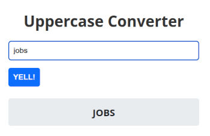

# Simple AJAX Demo Based on Java

This document explains how to use the `Element` class in a practical servlet-based application built on [Ujorm](https://ujorm.org/) and Vanilla JavaScript (ES6).

Why this approach can be attractive in real projects:

- Java-first UI rendering: HTML is composed in Java code, so refactoring tools and static analysis work directly on page structure.
- No template runtime layer: unlike template engines (for example JSP, Thymeleaf, or FreeMarker), this flow does not depend on parsing template files during request handling.
- Shared rendering logic for GET and AJAX: the same methods can render full pages and partial fragments, which helps keep behavior consistent.
- Clear server/client contract: AJAX responses are explicit selector-to-HTML mappings (`JsonBuilder`), making partial updates straightforward to reason about.
- Small conceptual surface: `Element`, `HtmlElement`, and `JsonBuilder` cover most of the rendering flow without requiring a large frontend framework.

The demo is centered around `TutorialServlet`, which implements two rendering modes:

- full-page server-side rendering in `doGet()`
- partial page updates in `doPost()` for AJAX requests

In other words, this servlet demonstrates how to build HTML pages as a structured XML-like tree directly in Java code, and how to update only selected parts of the page via JSON responses.

Implementation reference: [TutorialServlet.java](project-m2/ujo-web/src/test/java/org/ujorm/tools/tutorial/TutorialServlet.java)

## Server Screenshot and Context

The screenshot below is from the `TutorialServlet` demo page after the server starts.
It illustrates the main tutorial use case: a form rendered on the server, submitted from the browser, and then updated either by full-page reload or by AJAX fragment replacement.

What this screen represents:

- a page generated fully in Java using `Element` / `HtmlElement`
- an interactive form posting data to the servlet
- an output area (for example `.ajax-output`) that can be refreshed without reloading the whole page
- a minimal AJAX workflow where the backend returns `selector -> html` mappings via `JsonBuilder`

<p align="center">
  
</p>

Source code for this screen:   
[`TutorialServlet.java`](project-m2/ujo-web/src/test/java/org/ujorm/tools/tutorial/TutorialServlet.java)

## Element Tutorial

This guide shows how to build HTML pages and AJAX responses in this project using:

- `TutorialServlet` - orchestration of the GET/POST flow
- `Element` - fluent builder for HTML tags and attributes
- `HtmlElement` - document root (`html`, `head`, `body`) and output configuration
- `JsonBuilder` - JSON response builder for partial page updates

## 1) Mental Model

Use this model:

1. `doGet()` renders a complete HTML page.
2. `doPost()` returns a JSON map (`"selector -> new HTML content"`) when the AJAX parameter is present.
3. `Element` composes tags with fluent chains (`addDiv().addHeading().setClass(...)`).
4. `JsonBuilder` returns HTML fragments escaped into JSON string values.

In `TutorialServlet`, this means:

- GET builds a form with an input and output block (`Css.output`).
- POST returns updated content for `.ajax-output` on AJAX requests.
- without AJAX, POST falls back to classic server-side rendering (`doGet()`).

## 2) `HtmlElement`: Document Entry Point

`HtmlElement` / `AbstractHtmlElement` is the entry point for a full HTML document:

- opens and closes the root document (`try-with-resources`)
- keeps singleton `head` and `body`
- supports configuration (`title`, CSS links, `charset`, pretty formatting)

Typical pattern:

```java
try (var html = AbstractHtmlElement.of("Page title", ctx)) {
    html.getHead().addStyle().addRawText("/* css */");
    try (var body = html.addBody()) {
        body.addHeading("Hello");
    }
}
```

## 3) `Element`: HTML Building Blocks

`Element` is a fluent API on top of an HTML/XML builder. Key rules:

- `addXxx()` creates a child element (`addDiv`, `addForm`, `addInput`, ...)
- `setXxx()` sets an attribute (`setClass`, `setName`, `setValue`, ...)
- `addText()` escapes text (safe for normal content)
- `addRawText()` writes raw text (use only for trusted content, e.g. internal CSS/JS)

Examples:

```java
body.addDiv("card")
    .addHeading("Title")
    .addParagraph().addText("Safe text");
```

```java
form.addInput("my-input")
    .setType(Html.V_TEXT)
    .setName("query")
    .setValue("abc");
```

### Important Performance Note

`Element.addElement(...)` may internally return a reused child builder instance.
Therefore, avoid storing sibling child references longer than necessary while creating other elements at the same level.

Safe patterns:

- compose fluent chains inline
- or use short `try (...) { ... }` blocks as in `TutorialServlet`

## 4) `TutorialServlet`: GET and POST Flow Step by Step

### GET (`doGet`)

1. create `ExchangeContext`
2. open HTML document
3. add CSS and JavaScript to `head` (`JavaScriptWriter`)
4. build a form in `body`:
   - input (`TEXT`)
   - submit button
   - output box with CSS class `ajax-output`
5. render output content via `printResult(...)`

### POST (`doPost`)

1. read `DEFAULT_AJAX_REQUEST_PARAM`
2. if `true`, return JSON via `JsonBuilder`
3. JSON includes the key `.ajax-output` with a newly rendered HTML fragment
4. if missing, call `doGet()` (non-AJAX fallback)

## 5) `JsonBuilder`: Server-Side Diff for Frontend

`JsonBuilder` creates a simple JSON object where the key is a CSS selector:

- `writeId("result", ...)` -> key `"#result"`
- `writeClass("ajax-output", ...)` -> key `".ajax-output"`
- `write("key", ...)` -> key `"key"` (no prefix)

In this project:

```java
try (var json = JsonBuilder.of(ctx)) {
    json.writeClass(Css.output, e -> printResult(e, ctx));
}
```

This means: replace all elements with class `.ajax-output` using newly generated HTML from `Element`.

## 5.1) How AJAX Works in the HTML Page

The generated JavaScript (`JavaScriptWriter`) attaches behavior directly to HTML forms and keeps updates lightweight:

1. **Initialization on page load**
   - On `DOMContentLoaded`, `ujorm1.init()` scans all `<form>` elements.
   - For each form, it binds:
     - `submit` -> `process(e, form)`
     - `keyup` and `change` on inputs (`input:not([type='button'])`, `textarea`, `select`) -> `timeEvent(form)`

2. **Debounce for typing/editing**
   - `timeEvent(form)` clears the previous timeout and starts a new one (`delayMs`, default 250 ms).
   - This prevents sending one request per keystroke.
   - After the delay:
     - if no request is running: call `process(null, form)`
     - if a request is already running: set `submitReq=true` (queue one follow-up refresh)

3. **AJAX submission (`process`)**
   - Prevents default submit navigation (`e.preventDefault()`), so the page does not reload.
   - Collects form values into `FormData`.
   - If a submit button triggered the event, its `name/value` is appended too (`e.submitter`), preserving native submit semantics.
   - Sends `fetch("?_ajax=true", { method: "POST", body: new URLSearchParams(fd), headers: {"X-Requested-With":"XMLHttpRequest"} })`.

4. **Server response contract**
   - The server returns JSON generated by `JsonBuilder`, where:
     - key = CSS selector (for example `.ajax-output`, `#result`)
     - value = HTML fragment string
   - Client loops through entries:
     - normal selector -> `document.querySelectorAll(selector).forEach(el => el.innerHTML = value)`
     - empty selector `""` -> call a JavaScript function from `fceMap` (`writeJsKey(...)` use case)

5. **Concurrency and reliability**
   - `ajaxRun` prevents overlapping writes from multiple in-flight requests.
   - `submitReq` guarantees the latest user change is not lost while one request is still processing.
   - In `finally`, once the current call ends, a queued refresh is immediately executed.
   - On network/server failure, the error is logged (`console.error(err)`), and the state machine still resets.

In short, the page remains server-rendered, while user edits trigger delayed AJAX POST calls that update only selected DOM fragments using the same backend rendering methods as full-page GET.

### Request/Response Sequence (ASCII)

```text
User typing / submit
        |
        v
Browser (ujorm1.timeEvent/process)
  - debounce 250 ms
  - POST ?_ajax=true
        |
        v
Servlet (`doPost`)
  - detects AJAX parameter
  - renders fragment via `Element` / `printResult(...)`
  - returns JSON via `JsonBuilder`
        |
        v
JSON payload
  {
    ".ajax-output": "<div>...</div>"
  }
        |
        v
Browser JS loop
  Object.entries(data).forEach(...)
  -> querySelectorAll(".ajax-output")
  -> el.innerHTML = "<div>...</div>"
        |
        v
Updated page fragment (no full reload)
```

## 6) Practical Template for a New Page

Procedure:

1. create servlet `@WebServlet("/my-page")`
2. in `doGet()`, build the full page with `AbstractHtmlElement.of(title, ctx)`
3. give interactive blocks stable CSS classes or IDs
4. in `doPost()`, split AJAX vs non-AJAX logic
5. for AJAX responses, return fragments only via `JsonBuilder`
6. generate fragments using the same method as server-side rendering (DRY), e.g. `printResult(...)`

## 7) Conventions for AI Clients

If an AI client receives this README, follow these rules:

- use `try-with-resources` for `HtmlElement`, `Element`, and `JsonBuilder`
- build HTML with the `Element` fluent API, not by manual string concatenation
- use `addText()` for normal content; use `addRawText()` only for trusted raw content
- for AJAX updates, return JSON map selector -> HTML (`writeId` / `writeClass`)
- reuse existing selector constants (`Css.output`, etc.) instead of ad-hoc strings
- keep rendering logic in shared methods (`printResult(...)`) so GET and POST produce identical output

## 8) Most Common Mistakes

- missing `DEFAULT_AJAX_REQUEST_PARAM` -> client expects JSON, server returns full HTML page
- using `addRawText()` for user input -> XSS risk
- selector mismatch between frontend and `JsonBuilder` -> update is not applied
- duplicated render logic in GET/POST -> inconsistent UI

## Maven Dependency

Add this dependency to your `pom.xml`:

```xml
<dependency>
    <groupId>org.ujorm</groupId>
    <artifactId>ujo-web</artifactId>
    <version>latest</version>
</dependency>
```

For production use, prefer pinning a concrete version instead of `latest`.

## JavaDoc

- `Element`: [JavaDoc](https://www.javadoc.io/doc/org.ujorm/ujo-web/latest/org/ujorm/tools/web/Element.html)
- `HtmlElement`: [JavaDoc](https://www.javadoc.io/doc/org.ujorm/ujo-web/latest/org/ujorm/tools/web/HtmlElement.html)
- `JsonBuilder`: [JavaDoc](https://www.javadoc.io/doc/org.ujorm/ujo-web/latest/org/ujorm/tools/web/json/JsonBuilder.html)

## Internet Links

- Ujorm home page: [https://ujorm.org/](https://ujorm.org/)
- JavaScript ES6 Fetch API guide: [https://www.freecodecamp.org/news/a-practical-es6-guide-on-how-to-perform-http-requests-using-the-fetch-api-594c3d91a547/](https://www.freecodecamp.org/news/a-practical-es6-guide-on-how-to-perform-http-requests-using-the-fetch-api-594c3d91a547/)
- License: [Apache License, Version 2.0, January 2004](LICENSE.txt)
- Project home page: [https://github.com/pponec/demo-ajax](https://github.com/pponec/demo-ajax)